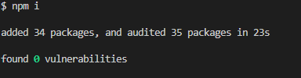
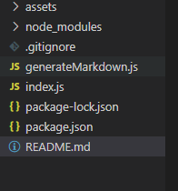
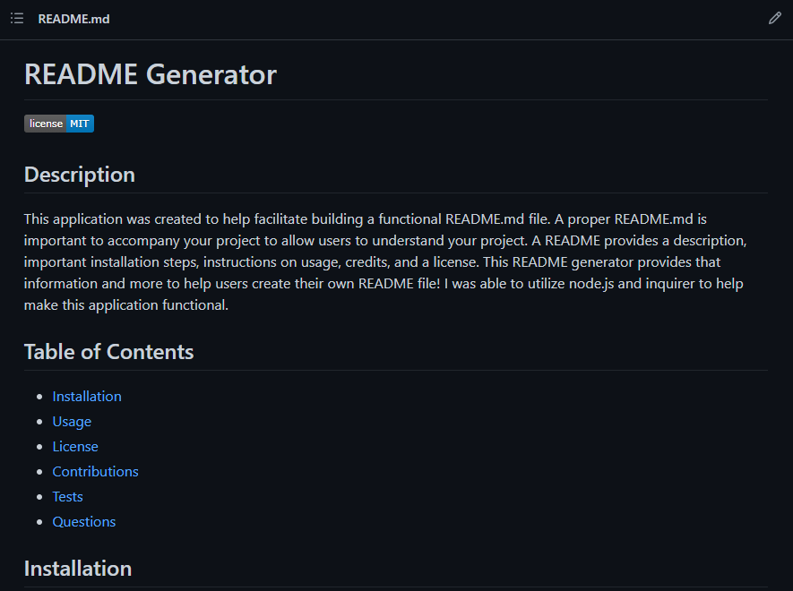

## Daily Planner

## Description

This application was created to help facilitate building a functional README.md file. A proper README.md is important to accompany your project to allow users to understand your project. A README provides a description, important installation steps, instructions on usage, credits, and a license. This README generator provides that information and more to help users create their own README file! I was able to utilize node.js and inquirer to help make this application functional. 

## Installation
Clone the following files: 
-index.js
-generateMarkdown.js
-package.json
-.gitignore

## Usage

To use the application he user the use can open the terminal in VScode
-Start node by typing in the command line: npm i
    To confirm inquirer was installed you should see this in your terminal: 
    and your your explorer tab should have the following files generated 
    
-Next in the command line type: node index.js and you will be prompted to fill out the readme sections 

The test [website](https://github.com/elizabeth189/README-TEST) allows you to view the test README used for submission 

You can look through the files to check out how I created this README generator! 

## License
Please refer to the LICENSE in the repo.

